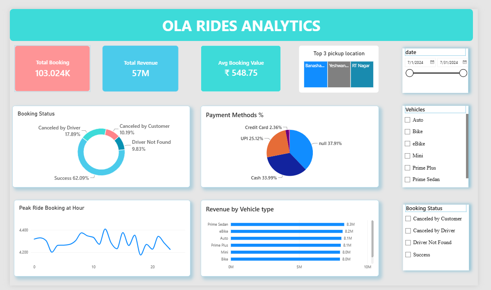

# 🚕 Ola Rides Analytics Dashboard

**A SQL + Power BI project analyzing 100K+ ride bookings to uncover cancellation trends, revenue drivers, and demand patterns.**

## 📌 Problem Statement
Ola loses revenue whenever bookings don't convert into completed rides. This project analyzes 103,024 July 2024 bookings to find where rides are being lost, which vehicle types and payment methods drive the most revenue, and when demand peaks — to help reduce cancellations and improve driver allocation.

## 🗂️ Dataset
- 103,024 bookings · July 2024
- Fields: Date,Time,Booking_ID,	Booking_Status,	Customer_ID, Vehicle_Type, Pickup_Location,	Drop_Location, V_TAT, C_TAT,	Canceled_Rides_by_Customer,	Canceled_Rides_by_Driver, Incomplete_Rides,	Incomplete_Rides_Reason	Booking_Value,	Payment_Method,	Ride_Distance,	Driver_Ratings,	Customer_Ratings.

## 🛠️ Tools
MySQL Workbench (data cleaning & querying) · Power BI (dashboard)

## What I Did
1. Imported raw CSV data into MySQL and resolved real-world import issues — encoding errors, column mismatches, inconsistent line endings
2. Validated data quality: checked for duplicates, invalid values, and confirmed missing fields (ratings, payment) were expected for cancelled rides
3. Wrote SQL queries to analyze booking status, cancellations, revenue by vehicle type, peak hours, and top locations
4. Built an interactive Power BI dashboard with KPI cards, charts, and slicers for filtering by date, vehicle, and status

## 📊 Key Findings
- **103,024 bookings generated ₹57M in revenue** at an average fare of ₹548.75
- **Only 63.97K rides (62.09%) completed successfully**
 — driver cancellations (18.43K) were nearly double customer cancellations (10.5K), pointing to a driver-availability problem rather than a demand problem
- **PRIME SEDAN was the top-earning vehicle category**
- **CASH was the most-used payment method** (33.99%)
- **Demand peaked around 12hour **, useful for planning driver shifts
## Recommendation
Driver cancellations are almost double customer cancellations, so the real problem isn't demand — it's driver availability. Fixing that first would recover more lost rides than any customer-facing change.
## Dashboard

## 📁 Files in This Repo
- `Ola_Rides_Dashboard.pbix` — Power BI dashboard
- `OLAqueries.sql` — all SQL queries used
- `screenshot/` — dashboard preview images

---
**[Ananya Singh]** 
· [linkedin.com/in/ananya-singh04] 
